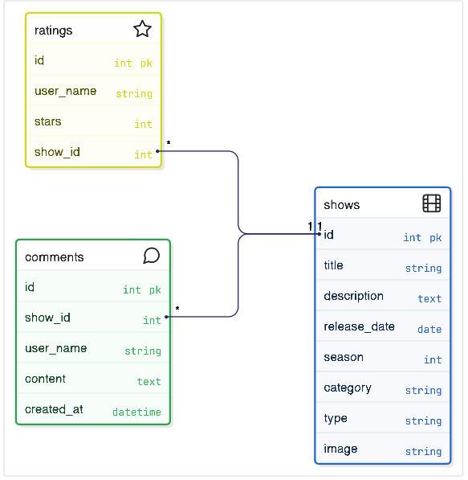
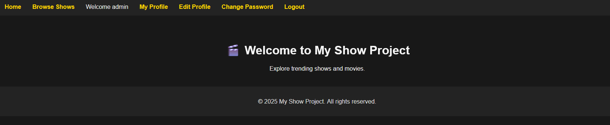
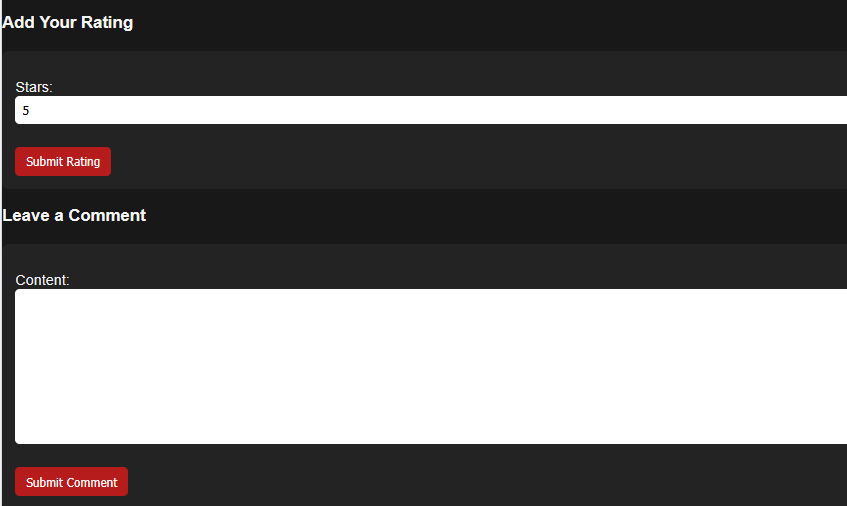
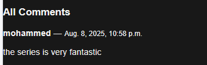
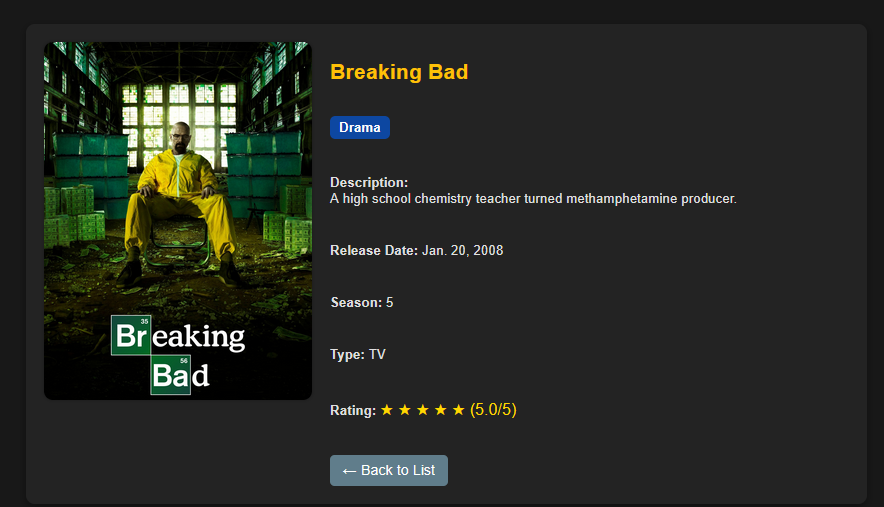
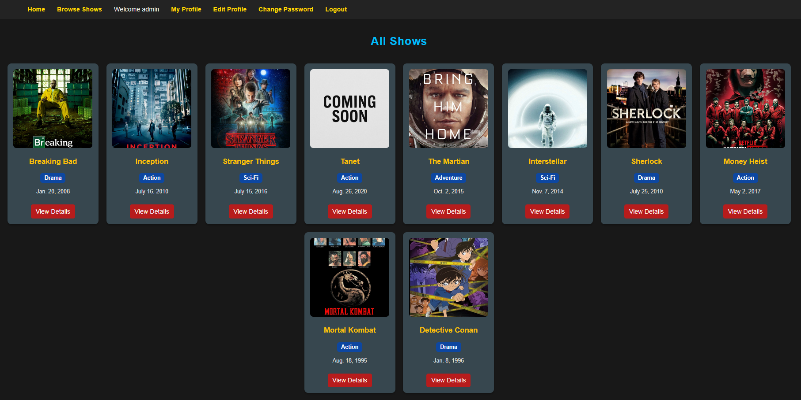
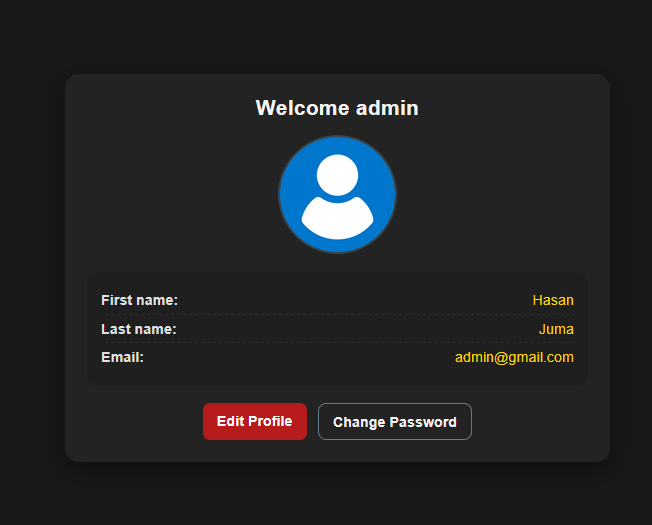
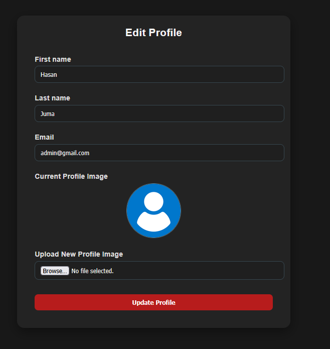

# Movie & Series Review Platform

A Django-based platform that allows registered users to browse, rate, and comment on movies and TV shows. Admins can manage content and user accounts.

---

## 📸 Screenshots

---

### 🗺️ ERD

### 🖥️ Home Page

### 🧾 Submit Comment  + Add Rating

### 🧾 View all comments

### Show Details

### Show List

### Profile User 

### Edit Profile User 

---

## Features
- User registration and login
- Only registered users can post ratings and comments
- Display average ratings for each show
- User profile with option to edit first name, last name, and profile picture
- Password change functionality
- Default profile picture for users who don't upload one
- Admin panel to manage users, shows, ratings, and comments

---

## Tech Stack
- Backend: Django 5.x, Python 3.12
- Database: SQLite (can be replaced with PostgreSQL/MySQL)
- Frontend: HTML, CSS, Django Templates
- Static/Media: Django static files + media uploads

---

## User Stories

### 👥 User Stories (User)

1. 👤 As a user, I want to register on the site so that I can participate with comments and ratings.  
2. 📋 As a user, I want to log in to my account to share my ratings and saved content.  
3. ⭐️ As a user, I want to rate a film/series from 1 to 5 stars.  
4. 📝 As a user, I want to update my personal profile details such as firstname ,lastname , email , and profile picture.  
5. 🗂 As a user, I want to view all films/series displayed as cards on the homepage.  
6. 🔍 As a user, I want to view the details of a film/series along with comments and ratings.  

---

### 🛠 User Stories (Admin )

1. 🎬 As an admin, I want to add a new film/series so that users can rate and watch it.  
2. ✏️ As an admin, I want to edit the details of a film/series to fix errors or add new content.  
3.  🗑 As an admin, I want to delete inappropriate or outdated content.  
4. 👥 As an admin, I want to manage user accounts to maintain system safety and control permissions.

---

## Installation
`bash
# Clone repository
git clone <repo_url>

# Navigate to project
cd Show-Project

# Create virtual environment
python -m venv venv

# Activate environment
source venv/bin/activate   # Mac/Linux
venv\Scripts\activate      # Windows

# Install dependencies
pip install -r requirements.txt

# Apply migrations
python manage.py migrate

# Create superuser
python manage.py createsuperuser

# Run server
python manage.py runserver

---

### 🚀 Future Improvements

- Enhance the Homepage interface .
- Send email notifications when a show is created or a reply is added .
- Allow the user to add series/ Movie
- Add "Forgot Password" feature . 
- Implement pagination for shows and comments

